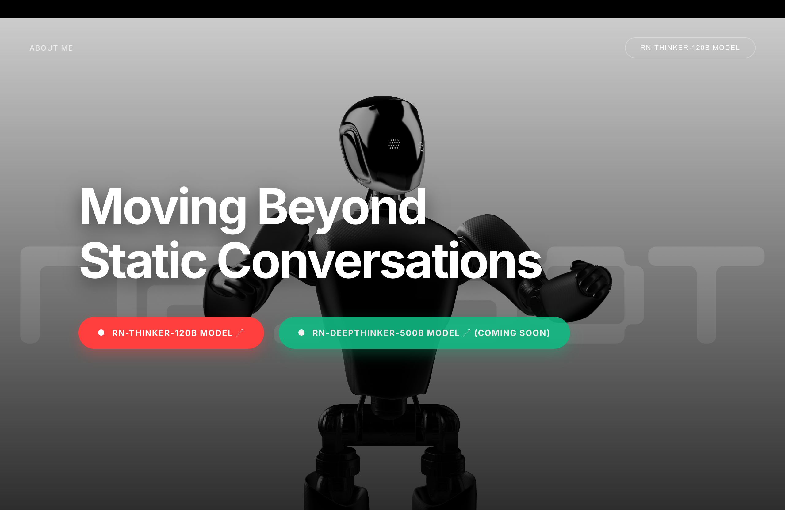

# 🤖 RN-ai: Beyond Static Conversations

RN-ai is a cutting-edge, high-performance AI chatbot platform built to push the boundaries of modern web development and LLM integration. Featuring a stunning 3D interactive interface and multi-model AI orchestration, it represents the next step in conversational interfaces.


## ✨ Features

- **3D Immersive UI**: Powered by Spline, featuring an interactive robot that follows your cursor and reacts to the environment.
- **Multi-Model Orchestration**: Intelligently switches between **Llama 3.1 8B (NVIDIA)** and **Gemini 1.5 Flash (Google)** for optimal speed and reasoning.
- **Context-Aware Memory**: Implements full chat history persistence using SQLAlchemy, allowing for deep, multi-turn conversations.
- **Terminal-Style Interface**: A sleek, hacker-aesthetic chat interface designed for developers and power users.
- **Serverless Optimized**: Fully configured for Vercel deployment with optimized response times.

## 📸 Screenshots

| Landing Page | Chat Interface |
| :---: | :---: |
|  |  |

### Landing Page
The landing page features a high-fidelity 3D robot background that follows user interaction, setting the stage for a futuristic AI experience. It highlights the core mission: moving beyond static text to dynamic, immersive conversations.

### Chat Interface
The AI terminal provides a sleek, developer-focused environment. With glassmorphism effects and a command-line aesthetic, it offers a "hacker" feel while maintaining high usability and clear AI-user distinction.

## 🛠️ Tech Stack

### Backend
- **Framework**: Flask (Python)
- **AI Engine**: LangChain
- **LLMs**: Meta Llama 3.1 8B (via NVIDIA NIM), Google Gemini 1.5 Flash
- **Database**: SQLAlchemy (SQLite/PostgreSQL)
- **Environment**: Dotenv for secure secret management

### Frontend
- **Design**: Vanilla CSS with Glassmorphism & Cyberpunk aesthetics
- **3D Graphics**: Spline Runtime
- **Interactions**: Vanilla JavaScript

## 🚀 Getting Started

1. **Clone the repository:**
   ```bash
   git clone https://github.com/aryanRN2/ai-chatbot.git
   cd ai-chatbot
   ```

2. **Install dependencies:**
   ```bash
   pip install -r requirements.txt
   ```

3. **Set up your environment variables:**
   Create a `.env` file and add:
   ```env
   GOOGLE_API_KEY=your_key_here
   NVIDIA_API_KEY=your_key_here
   FLASK_SECRET_KEY=your_secret_key
   ```

4. **Run the development server:**
   ```bash
   python app.py
   ```

## 🧠 What I Learned
- **LLM Context Management**: Mastered LangChain's memory patterns to maintain state across stateless requests.
- **Asynchronous AI Integration**: Optimized model selection to handle real-time chat within serverless constraints.
- **3D Web Integration**: Bridging the gap between 3D design (Spline) and functional web applications.
- **Deployment Pipelines**: Managing persistent data and environment variables in Vercel.

---
Built with ❤️ by [Aryan Maurya](https://github.com/aryanRN2)